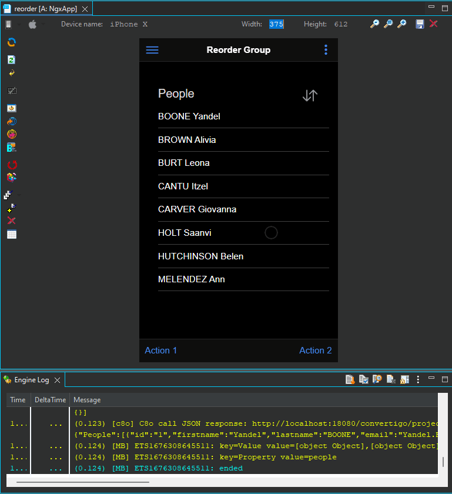

#  reorder

Convertigo NGX builder sample project : Reorder component.

<i>Connectors</i>
<blockquote>

##  void

void connector, replace or don't use it

<i>Transactions</i>
<blockquote>

###  void

does nothing

</blockquote>

</blockquote>

<i>Sequences</i>
<blockquote>

##  generatePeople

Generate a list of fictive people

Variables

<table>
<tr>
<th>
name
</th>
<th>
comment
</th>
</tr>
<tr>
<td>
&nbsp;nbr
</td>
<td>
Number of results to return
</td>
</tr>
<tr>
<td>
&nbsp;search
</td>
<td>
Search by lastname filter
</td>
</tr>
<tr>
<td>
&nbsp;start
</td>
<td>
Starting index
</td>
</tr>
</table>

</blockquote>

<i>Mobile Application</i>
<blockquote>

##  Application

This is a sample demo project that uses the <strong>Reorder group</strong> and <strong>Reorder</strong> components. 
It displays a list of fictive people you can reorder.

<ul>
<li>Click the reorder icon to enable/disable reordering on the list.</li>
<li>Drag and drop elements of the list to reorder them.</li>
<li><strong>ionItemReorder</strong> event is fired and must contain <strong>event.detail.complete()</strong> function (in a CustomAction component).</li>
<li>The people list is generated by a sequence and saved in a local page variable (<strong>page.local.people</strong>). Pass this variable to the <strong>complete()</strong> method to sync DOM and Array data when list is reordered.</li>
</ul>

<i>Pages</i>
<blockquote>

###  Page

Reorder component usage. 

</blockquote>

</blockquote>

